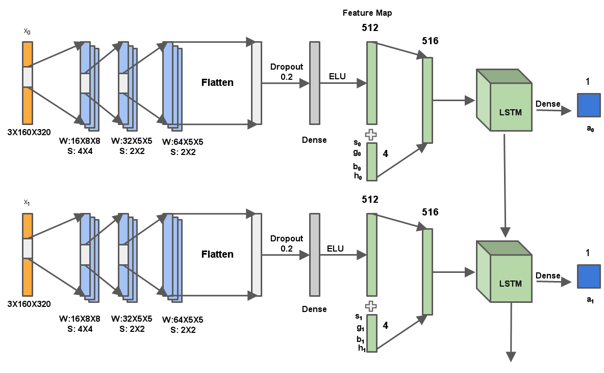

# Driving State Prediction using LRCN
In this project, we are currently extending on the prior art for predictive modeling of the other driving states like gas pedal (accelerator), clutch, gear lever, brake pedal press using multi-sensor integration for modeling of these states. We are implementing a LRCN (LSTM + CNN) model for the driving state prediction. The publicly available driving dataset consisting of 7.25 hours of highway rich quality video feed with other sensor data like speed, acceleration, 3D LIDAR along with car driving control variable data for the training.

## Comma.ai's paper

[Learning a Driving Simulator](http://arxiv.org/abs/1608.01230)

## Dataset:: Comma.ai and Udacity online released driving dataset

The dataset used in the project is taken from the the online release dataset from comma.ai. The dataset consists of 7.5 hours of driving on highways. It is divided into 11 sub-datasets where currently we are using 9 for training while other 2 for testing.

Apart from commai.ai dataset, we are also using the datasets provided by Udacity. The dataset provided by Udacity is also taken on 2016 Lincoln MKZ. It uses 2 velodyne VLP-16 LiDARs, 1 Delpi radar, 3 Point Grey Blackfly cameras, an Xsens IMU, an ECU for sensor data collection.

## Our LRCN Model

We present a Long-recurrent convolutional network model for predicting the driving states where both temporal as well as spacial information is preserved in the network. 

[More Details are presented in the end-term report](./report/report.pdf)

## Requirements
[anaconda](https://www.continuum.io/downloads)  
[tensorflow-0.9](https://github.com/tensorflow/tensorflow)  
[keras-1.0.6](https://github.com/fchollet/keras)  
[cv2](https://anaconda.org/menpo/opencv3)
